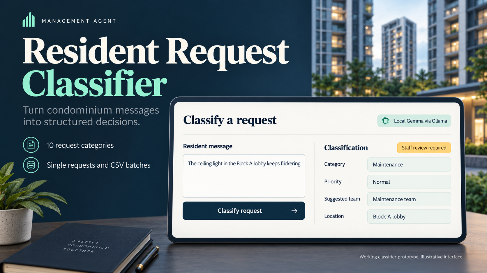

# Management Agent - resident request classifier

A runnable first phase for a condominium property-management project. A resident
message becomes a **category, priority, suggested team and review decision**.
It runs immediately with a small offline classifier, and includes an Ollama adapter
for experimenting with open-weight language models.

## View the showcase - no installation

**[Open the online showcase](https://skithrills.github.io/condo-request-classifier/)**
for the two hero images, narrated video and all eight slides. It works on another
computer or phone without the original development PC.



| View or download | File |
| --- | --- |
| Video, approximately 79 seconds | [MP4](output/demo/Management_Agent_Classifier_Demo.mp4) |
| Presentation | [PDF](output/slides/Management_Agent_Classifier_Showcase.pdf) · [Editable PowerPoint](output/slides/Management_Agent_Classifier_Showcase.pptx) |
| Hero images | [Project showcase](output/hero/01-classifier-showcase.png) · [Classifier architecture](output/hero/02-classifier-architecture.png) |
| Everything for presenting | [Release downloads](https://github.com/Skithrills/condo-request-classifier/releases/latest) |
| Complete source and media | [Download ZIP](https://github.com/Skithrills/condo-request-classifier/archive/refs/heads/main.zip) |

The online showcase is a static presentation. To submit new requests to the
working classifier, run the Streamlit app below. GitHub Pages does not run Python
or Ollama. The original video demonstrates the offline baseline; the slides also
include the later local Gemma evaluation. All demonstration requests are synthetic.

## Quick start on a fresh machine

Install [uv](https://docs.astral.sh/uv/getting-started/installation/), then clone
the repository (requires Git):

```sh
git clone https://github.com/Skithrills/condo-request-classifier.git
cd condo-request-classifier
uv sync --locked --python 3.12
uv run streamlit run app.py
```

Alternatively, use **Code → Download ZIP**, extract it, open a terminal inside
the extracted folder, and run the last two commands. `uv` can install Python 3.12
when needed. The initial dependency download requires internet access.

Open **http://localhost:8501**. The **Offline baseline** works immediately with
the bundled synthetic training data: no API key, Ollama or model download is
required. After dependencies are installed, it can classify offline. Stop the
website with **Ctrl+C** in its terminal. Windows, macOS and Linux can use these
commands; the convenience launchers below are Windows-specific.

## Windows launchers

The prototype website is already implemented in `app.py`. Its form calls
`condo_classifier.service.Classifier` with the project's offline or Ollama backend;
the results are live classifications, not prewritten demo responses.

After completing the dependency setup, run the offline app from the project folder:

```powershell
.\start_project.cmd -SkipOllama
```

This starts or reuses this project's Streamlit website. Keep the launcher window
open. Once Ollama and its model are installed as described below, double-click
**`start_project.cmd`** to start both Ollama and the website. The launcher does not
configure Windows startup or download models. Stopping the website leaves Ollama
running in the background.

The **Offline baseline** is selected by default and needs no API key. To use local
Gemma, choose **Ollama** in the sidebar; the example configuration uses `gemma3:4b`.
Allow extra time for its first request while the model loads. To start only the
website, without starting Ollama:

```powershell
.\start_project.cmd -SkipOllama
```

`-NoBrowser` suppresses automatic browser opening. `run_app.cmd` is also available
as a simple website-only launcher. Neither launcher publishes the site online.

The interface provides single-request classification, a CSV batch workflow,
downloadable JSON/CSV results, a category guide, an evaluation dashboard, and a
**Showcase & setup** tab with slides, video and startup instructions.

The [79-second narrated demo](output/demo/Management_Agent_Classifier_Demo.mp4)
shows the working app with captions. It is an edited walkthrough of captured app
screens; see [demo files and rebuild instructions](output/demo/README.md).

The slide version is available as an editable
[PowerPoint](output/slides/Management_Agent_Classifier_Showcase.pptx) and a
[PDF](output/slides/Management_Agent_Classifier_Showcase.pdf). Preview the slides
inside **Showcase & setup**. The deck includes the later local Ollama results;
the original video shows the earlier offline demo.

## What it classifies

| Category | Examples | Suggested team |
| --- | --- | --- |
| Maintenance | Leaks, lights, lift faults, broken equipment | Maintenance team |
| Security & access | Lost passes, suspicious entry, CCTV requests | Security desk |
| Noise & nuisance | Loud music, barking, renovation noise complaints | Resident relations |
| Cleaning & pests | Rubbish, dirty common areas, pests | Estate services |
| Facilities & bookings | Court, function-room and BBQ reservations | Facilities desk |
| Parking | Visitor permits, occupied lots, obstructing vehicles | Parking desk |
| Billing & payments | Fees, receipts, deposits, refunds | Finance team |
| Renovation & moving | Work applications, contractors, movers | Estate management |
| General enquiries | Office hours, notices, house rules | Management office |
| Other / unclear | Insufficient context or unrelated requests | Management office |

One primary category is returned. Independent requests in one message are flagged
for review when detected. A broken pool pump is maintenance, a pool reservation is
facilities, and a pool-booking refund is billing. Labels and teams are starter
assumptions for staff to confirm; edit `condo_classifier/taxonomy.py` and the data
together when changing them.

## How this relates to Jev

Jev accepts state and typed questions and returns structured decisions.
This project applies that useful pattern to one bounded domain:

| Decision | This project's output |
| --- | --- |
| Choice | One category from a fixed enumeration |
| Urgency | An ordered priority: low, normal, high, emergency |
| Uncertainty | Baseline class scores or an explicitly labelled LLM self-estimate |
| Human handoff | A deterministic review flag and reasons |

This is a project-specific implementation, not Jev's model or a benchmark-equivalent
replica. Its scores are **not calibrated**. The review flag is policy logic, not a
Jev Noul probability. The LLM adapter does not fabricate a probability distribution.
Real labelled examples and a separate calibration split are needed before scores
can justify automatic routing. See `docs/MODEL_CARD.md`.

## Architecture

```text
Streamlit or Python/CLI
        ↓
Pydantic input validation
        ↓
LangGraph: safety_screen → classify → review_policy
              └───────────────────────────↑
        ↓
Validated JSON classification / staff review
```

- **Offline baseline:** word and character TF-IDF features plus logistic regression,
  trained on the bundled 140 synthetic English messages. The model is fitted locally;
  evaluation examples are never passed to `fit`.
- **Ollama:** LangChain `ChatOllama` plus schema validation, grounded evidence spans,
  and one retry for invalid output. Local mode sends a JSON schema. Cloud mode asks
  for JSON and validates the response because Cloud currently lacks schema enforcement.
- **Review policy:** missing locations, low scores, multiple requests, sensitive
  actions and urgent reports are flagged. Every LLM classification requires review
  until its confidence has been independently evaluated.
- **Safety screen:** a small English rule set escalates selected explicit danger
  phrases before calling the model. It is incomplete and cannot serve as an emergency
  detection or dispatch service.

LangGraph supplies a small deterministic workflow here, not a multi-agent platform.
Chroma, RAG, browser/search tools, real work tickets, resident messaging and
fine-tuning are intentionally later phases. This phase never executes a ticket,
payment, access change or approval.

## Try Ollama locally

Install [Ollama](https://ollama.com/download), start it, then download the model:

```sh
ollama pull gemma3:4b
```

If Ollama is not already running, run `ollama serve` in another terminal. On
Windows you can instead start or reuse its server with:

```powershell
.\scripts\start_ollama.ps1
```

The launcher reuses a running server or starts the installed CLI in the background
at `http://127.0.0.1:11434`. It uses one request slot and a 4,096-token context to
limit GPU memory use. It does not add a startup task or change your user PATH.
Run it again after restarting Windows. Optionally copy `.env.example` to `.env`
to customize the configuration. On Windows, preserve an existing configuration:

```powershell
if (-not (Test-Path .env)) { Copy-Item .env.example .env }
```

On macOS/Linux, use `cp -n .env.example .env`. Keep
`OLLAMA_HOST=http://localhost:11434` and `OLLAMA_MODEL=gemma3:4b` in `.env`.
Set `OLLAMA_TIMEOUT_SECONDS=120` if cold model loading exceeds the default timeout.
Select **Ollama** in the sidebar. A local model needs sufficient RAM/VRAM; this
app does not download or install model weights automatically. The launcher accepts
`-OllamaExecutable` for a different binary location and also checks your PATH.

## Try Ollama Cloud

Create an Ollama API key and edit `.env` locally:

```dotenv
OLLAMA_HOST=https://ollama.com
OLLAMA_MODEL=gpt-oss:20b
OLLAMA_API_KEY=your_key_here
OLLAMA_TIMEOUT_SECONDS=45
```

Confirm the model is currently available using Ollama's model list at
<https://ollama.com/api/tags>. Direct Cloud model names differ from some local
daemon `:cloud` or `-cloud` aliases. The API key is read server-side and ignored by
Git. Cloud mode sends the message to Ollama. Use synthetic examples until your
estate has agreed its data-handling requirements. Ollama Cloud has not been tested
with live credentials; local Ollama verification is recorded separately below.

## Is Groq an alternative?

Yes. A suitable initial candidate is `openai/gpt-oss-20b` with
`response_format.type="json_schema"` and `strict=true`. Groq documents strict schema
support for this model. The existing `ModelDecision` contract and review policy can
be reused with a Groq-specific backend. Correct JSON still needs semantic validation
and evaluation against labelled requests.

Groq runs remotely and needs a `GROQ_API_KEY` and internet access; local Ollama runs
on your own hardware. The current app has **no Groq adapter**, and no live Groq
accuracy or latency measurements have been made. Do not put a Groq URL into the
Ollama server field: the two APIs use different request formats.

As checked on 2026-10-03, Groq lists GPT-OSS 20B at **US$0.075 per million input
tokens and US$0.30 per million output tokens**. For illustration, 1,000 input plus
200 total billed output tokens costs about US$0.000135 per request, or US$1.35 per
10,000 requests. This excludes retries and any extra reasoning tokens; actual usage
must be measured. Its listed free limits are 30 requests/minute, 1,000/day and
8,000 tokens/minute; your account's limits are authoritative.

For this project, start with local Gemma for offline development, then benchmark
Groq GPT-OSS 20B on the same frozen dataset if hosted deployment is needed. Retain
the staff-review policy for both. Check Groq's data controls before using real
resident messages; hosting open-weight models does not make the hosted service
self-hosted or offline.

Sources: [structured outputs](https://console.groq.com/docs/structured-outputs),
[models and prices](https://console.groq.com/docs/models),
[rate limits](https://console.groq.com/docs/rate-limits),
[data controls](https://console.groq.com/docs/your-data).

## Command line and Python

```powershell
uv run python -m condo_classifier classify "The lobby light is broken."
uv run python -m condo_classifier --backend ollama classify "Can I book the function room?"
uv run python -m condo_classifier evaluate --output reports/baseline-evaluation.json
```

```python
from condo_classifier.backends import BaselineBackend
from condo_classifier.schema import ResidentRequest
from condo_classifier.service import Classifier

classifier = Classifier(BaselineBackend())
result = classifier.classify(
    ResidentRequest(
        text="The corridor light keeps flickering.",
        location="Block A, level 5",
    )
)
print(result.model_dump_json(indent=2))
```

Provider failures return `status="provider_error"`, no confidence and a review
requirement. They never silently switch to the offline model. Emergency rules can
return `status="safety_escalation"` without using the selected provider. The `backend`
field always identifies which path supplied the result.

CSV input uses a required `text` column and optional `channel` and `location`.
Supported channels are `Web`, `WhatsApp`, `Email`, and `Phone transcript`. Use
`data/batch_example.csv` as a template. Up to 100 rows / 2 MB are accepted, invalid
rows are reported individually, and formula-like CSV cells are escaped on export.

## Verification

```powershell
uv run pytest -q
uv run ruff check .
uv run python -m condo_classifier evaluate
```

The starter evaluation contains 55 synthetic messages: 50 ordinary requests and
five explicit emergencies. Initial results: **53/55 categories correct (96.4%)**,
macro F1 **0.963**, priority accuracy **98.2%**, review rate **87.3%**, and **5/5**
explicit emergency examples flagged. Emergency cases include deterministic rules.
These are development checks on a small authored dataset, not production accuracy
or a reliable estimate of emergency recall.

Tests cover schemas, review rules, negated/hypothetical emergency phrases,
provider failures, retry limits, CSV handling, Streamlit interactions, and a real
LangChain HTTP round trip against a **simulated** Ollama endpoint.

### Live local Ollama verification - 2026-10-03

Ollama **0.35.0** was installed and tested entirely through the terminal/API, using
**`gemma3:4b` (4.3B parameters, Q4_K_M)** on an NVIDIA RTX 3080 with 10 GB VRAM.
All model layers were offloaded to the GPU. The installed model digest is recorded
in [the verification report](reports/ollama-verification.json).

The evaluation contains **55 cases, not 56**: 50 invoke the model, while five
explicit emergency cases use deterministic safety rules. On the final run:

- 48/50 model requests produced valid responses; two failed validation and went to review.
- 42/50 model requests produced a valid, correct category, compared with 48/50 for
  the offline baseline on these same ordinary examples. The baseline remains the default.
- Mean warmed latency was **1.12 seconds for valid responses**, or **1.32 seconds
  across all 50 attempts**, including validation retries. Median valid latency was
  **1.09 seconds**. The separate first cold request took **86.6 seconds**.
- A live Streamlit AppTest confirmed the Ollama result and the emergency-rule path.
  All **63 automated tests** and Ruff checks passed. The initial build had 56 tests;
  that number did not describe live model requests.

The first run exposed quoted evidence framing from the small model. Matching outer
quotation marks are now removed only when the remaining text is an exact input
span. Unsupported evidence still fails validation. The initial run is retained in
`reports/ollama-initial-evaluation.json`; the rerun is in
`reports/ollama-evaluation.json`. The latter's raw category metric counts one rejected
case's `other` fallback as correct, so the model-success comparison above excludes it.
Both runs use a synthetic development set; neither establishes production accuracy.
The existing video demonstrates the offline baseline and predates this live setup.

## Project files

- `app.py`: Streamlit interface.
- `condo_classifier/`: schemas, model adapters, triage workflow, CSV and evaluation.
- `data/`: synthetic training/evaluation data and example upload.
- `reports/baseline-evaluation.json`: reproducible metrics and every prediction.
- `reports/ollama-evaluation.json`: live local model evaluation and rejected responses.
- `reports/ollama-verification.json`: runtime/model identity, latency and live app checks.
- `scripts/start_ollama.ps1`: start or reuse the local background inference server.
- `docs/MODEL_CARD.md`: limitations and next steps for a credible pilot.
- `output/demo/`: presentation video, captions and supporting files.

## References

The supplied [crystalbuilds/llm-project](https://github.com/crystalbuilds/llm-project)
informed the prompt/schema/UI separation. This is a fresh implementation for
condominium requests; upstream application code is not vendored. The local
stakeholder reference informed the triage fields and approval boundary and is not
redistributed. Credentials, private inputs, local environments and model weights
are excluded from this repository.

- [TypeSafe's Jev introduction](https://docs.typesafe.ai/introduction)
- [Ollama structured outputs and the Cloud limitation](https://docs.ollama.com/capabilities/structured-outputs)
- [Ollama Cloud setup](https://docs.ollama.com/cloud)
- [LangChain ChatOllama](https://docs.langchain.com/oss/python/integrations/chat/ollama)
- [LangGraph graph API](https://docs.langchain.com/oss/python/langgraph/graph-api)
- [Streamlit app testing](https://docs.streamlit.io/develop/api-reference/app-testing/st.testing.v1.apptest)
